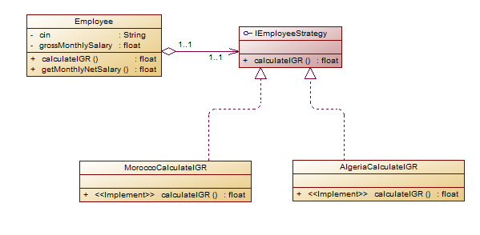
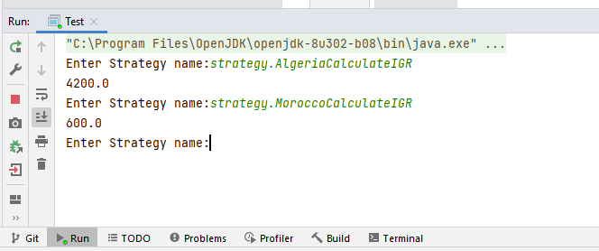
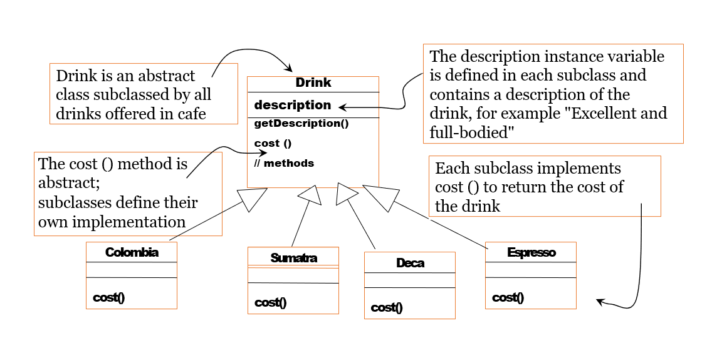
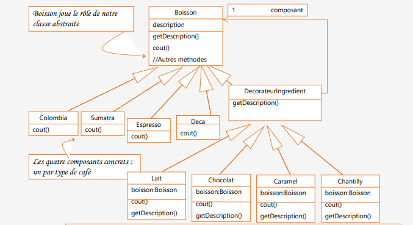
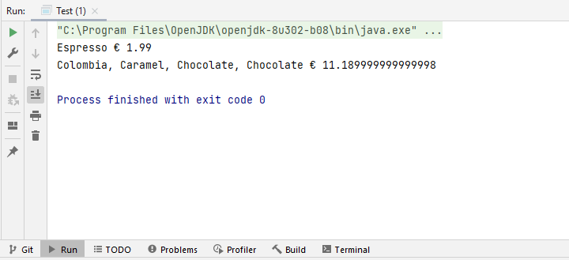
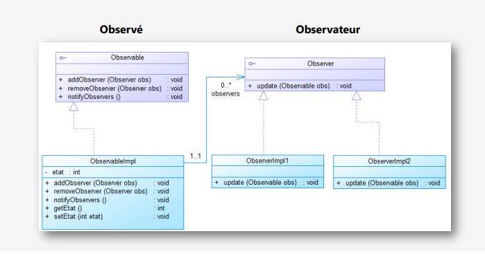
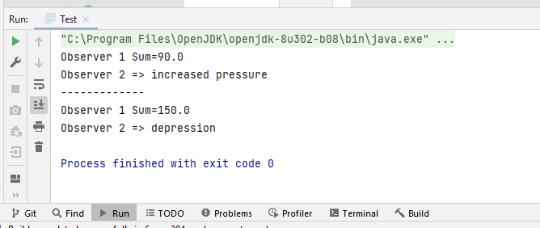
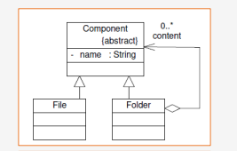
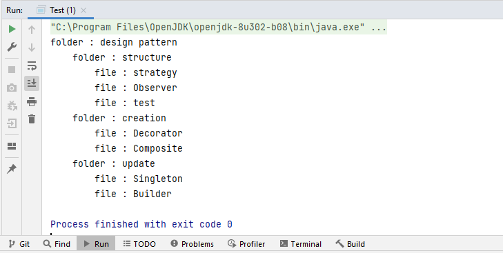

# Design Patterns

## Pattern Strategy
We consider the class Employee (see appendix) which is defined by:
* two instance variables cin and grossMonthly salary,
* two constructors, the getters and setters
* and a method to calculate IGR which returns the general tax on wage income.
* The getSalaireNetMonthly method returns the monthly net salary.

Assuming the formula for calculating IGR differs from country to country.
In Morocco, for example, the calculation is carried out according to the following cases:
* If the annual salary is less than 40,000, the IGR rate is: 5%
* If the annual salary is greater than 40,000 and less than 120,000, the IGR rate is: 20%
* If the annual salary is greater than 120,000, the IGR rate is: 42%

In Algeria, the calculation is made using a single rate of 35%.

As this class is intended to be used in different kind of countries unknown at the time of development of
this class,
1. Identify the methods that will undergo changes in the client.
2. Applying the strategie pattern, try to make this class closed to modification and open to extension.
3. Create a test application.
4. Propose a solution to dynamically choose the IGR calculation implementation.

```java
public class Employee {
    private String cin;
    private float grossMonthlySalary;
    public Employee(String cin, float grossMonthlySalary) {
        this.cin = cin;
        this.grossMonthlySalary = grossMonthlySalary;
    }
    public float calculateIGR(){
        float GrossAnnualSalary=grossMonthlySalary*12;
        float rate=42;
        return GrossAnnualSalary*rate/100;
    }
    public float getMonthlyNetSalary(){
        float igr=calculateIGR();
        float annualNetSalary=grossMonthlySalary*12-igr;
        return annualNetSalary/12;
    }
// Getters et Setters
}
``` 
## Design of the problem using the strategy design pattern



## Implementation

The change of the Employee class by adding a private attribute of type IEmployeeStrategy
```java 
private IEmployeeStrategy employeeStrategy; 
```  
IEmployeeStrategy which contains a public method float calculateIGR (float grossMonthlySalary); and this to make the application closed to modification and open to extension and also to make implementations evolve independently of the Employee class.
```java 
package strategy;

public interface IEmployeeStrategy {
    public float calculateIGR(float grossMonthlySalary);
}

```  

Changed the calculateIGR method so that it can use the defferrent implementations of the IEmployeeStrategy interface.

```java 
 public float calculateIGR(){
       return employeeStrategy.calculateIGR(grossMonthlySalary);
    }
```  

Then we add several implementations of the Employee Strategy interface so that we can calculate the IGR in different countries
#### MoroccoCalculateIGR
```java 
 package strategy;

public class MoroccoCalculateIGR implements IEmployeeStrategy{
    private final float rate1 = 5;
    private final float rate2 = 20;
    private final float rate3 = 42;
    @Override
    public float calculateIGR(float grossMonthlySalary) {
        float grossAnnualSalary=grossMonthlySalary*12;
        if(grossAnnualSalary <= 40000) return grossAnnualSalary*rate1/100;
        if(grossAnnualSalary > 40000 && grossAnnualSalary <= 120000) return grossAnnualSalary*rate2/100;
        if(grossAnnualSalary < 120000) return grossAnnualSalary*rate3/100;
        return  0;
    }
}
```  
#### AlgeriaCalculateIGR

```java 
package strategy;

public class AlgeriaCalculateIGR implements IEmployeeStrategy{
private final float rate = 35;
@Override
public float calculateIGR(float grossMonthlySalary) {
float grossAnnualSalary = grossMonthlySalary * 12;
return grossAnnualSalary * rate /100;
}
}
```  

## Test
we implement a Test class to dynamically choose the IGR computation implementation, for that we will use
```java 
Class.forName ()
``` 
#### Implementation
```java 
package strategy;

import java.util.Scanner;

public class Test {
    public static void main(String[] args) {

        Employee employee = new Employee("T3423",1000);
        Scanner clavier=new Scanner(System.in);
        while(true){
            System.out.print("Enter Strategy name:");
            String nomStrategy=clavier.next();
            if(nomStrategy.equals("quit")) break;
            try {
                Class c = Class.forName(nomStrategy);
                IEmployeeStrategy strategy = (IEmployeeStrategy) c.newInstance();
                employee.setEmployeeStrategy(strategy);
                System.out.println(employee.calculateIGR());
            } catch (Exception e) {
                System.out.println(e);
            } }
    }
}
``` 

#### Execution Example  Strategy




# Pattern Decorator
Starbuzz Coffee has made a name for itself by becoming the largest chain of "coffee shops" in the United States. When they started, they designed their classes like this:



In addition to your coffee, you can also request
several ingredients, like

* milk froth
* caramel
* chocolate
* vanilla

Starbuzz Coffee, charging for each of these extras, they have
need to integrate them into their control system.

# Design of the problem using the decorator design pattern



# Implementation

### Abstract Component Drink Class
```java 
package decorator;

public abstract class Drink {
    protected String description;
    public String getDescription() {
        return description;
    }
    public abstract double cost();
} 
```  
### Component Concrete Implementation
#### Colombia
```java 
package decorator.subDrink;

import decorator.Drink;

public class Colombia extends Drink {
    public Colombia(){
        description="Colombia";
    }
    public double cost() {
        return 7.89;
    }
}
```  
#### Espresso
```java 
package decorator.subDrink;

import decorator.Drink;

public class Espresso extends Drink {
    public Espresso(){
        description="Espresso";
    }
    public double cost() {
        return 1.99;
    }
}
```  
#### Sumatra
```java 
package decorator.subDrink;

import decorator.Drink;

public class Sumatra extends Drink {
    public Sumatra(){
        description="Sumatra";
    }
    public double cost() {
        return 8.99;
    }
}
```  
### DecoratorIngredient Class
```java 
package decorator;

public abstract class DecoratorIngredient extends Drink {
    protected Drink drink;
    public DecoratorIngredient(Drink drink) {
        this.drink = drink;
    }
    public abstract String getDescription();
}
```  

### Decorators
#### Chocolate


```java
package decorator.decorators;

import decorator.DecoratorIngredient;
import decorator.Drink;

public class Chocolate extends DecoratorIngredient {
    public Chocolate(Drink drink) {
        super(drink);
    }

    public double cost() {
        return 0.20 + drink.cost();
    }

    public String getDescription() {
        return drink.getDescription() + ", Chocolate";
    }
}
```
#### Caramel
```java
package decorator.decorators;

import decorator.DecoratorIngredient;
import decorator.Drink;

public class Caramel extends DecoratorIngredient {
    public Caramel(Drink drink) {
        super(drink);
    }

    public double cost() {
        return 2.90 + drink.cost();
    }

    public String getDescription() {
        return drink.getDescription() + ", Caramel";
    }
}
```
#### Vanilla
```java
package decorator.decorators;

import decorator.DecoratorIngredient;
import decorator.Drink;

public class Vanilla extends DecoratorIngredient {
    public Vanilla(Drink drink) {
        super(drink);
    }

    public double cost() {
        return 3.40 + drink.cost();
    }

    public String getDescription() {
        return drink.getDescription() + ", Vanilla";
    }
}
```


### Test
```java 
package decorator;

import decorator.decorators.Caramel;
import decorator.decorators.Chocolate;
import decorator.subDrink.Colombia;
import decorator.subDrink.Espresso;

public class Test {
    public static void main(String[] args) {
        Drink drink1=new Espresso();
        System.out.println(drink1.getDescription()+" € "+drink1.cost());
        Drink drink2=new Colombia();
        drink2=new Caramel(drink2);
        drink2=new Chocolate(drink2);
        drink2=new Chocolate(drink2);
        System.out.println(drink2.getDescription()+" € "+drink2.cost());
    }
}
``` 

### Execution Example  Decorator




# Design Pattern Observer



# Implementation

### Observable Interface
```java 
package observer.observalble;

import observer.observers.Observer;


public interface Observable {

    void subscribe(Observer observer);

    void unsubscribe(Observer observer);

    void notifyObservers();

}
```  
### Observable Implementation

```java 
package observer.observalble;


import observer.observers.Observer;

import java.util.ArrayList;
import java.util.List;


public class ObservableImpl implements Observable {

    private final List<Observer> observers = new ArrayList<>();
    private int state;

    @Override
    public void subscribe(Observer observer) {
        observers.add(observer);
    }

    @Override
    public void unsubscribe(Observer observer) {
        observers.remove(observer);

    }

    public int getState() {
        return state;
    }

    public void setState(int state) {
        this.state = state;
        this.notifyObservers();
    }

    @Override
    public void notifyObservers() {
        for (Observer obs : observers) {
            obs.update(state);
        }

    }

}
```  
### Observer Interface

```java 
 package observer.observers;

public interface Observer {
    void update(int state);
}
```  
### Observer Implementation 1
```java 
package observer.observers;

public class ObserverImpl1 implements Observer {
    private double sum;
    @Override
    public void update(int state) {
        sum += state;
        System.out.println("Observer 1 Sum=" + sum);
    }
}
``` 
### Observer Implementation 2
```java 
package observer.observers;

public class ObserverImpl2 implements Observer {
    double lastState;

    @Override
    public void update(int state) {
        if (state - lastState > 0)
            System.out.println("Observer 2 => increased pressure");
        else if (state - lastState < 0)
            System.out.println("Observer 2 => depression");
        else System.out.println("Observer 2 => Stability");
        lastState = state;
    }
}
``` 

# Test
we implement a Test class for test
```java 
package observer.observers;

import observer.observalble.Observable;
import observer.observalble.ObservableImpl;

public class Test {
    public static void main(String[] args) {
        Observable observable = new ObservableImpl();
        Observer observer1 = new ObserverImpl1();
        Observer observer2 = new ObserverImpl2();
        observable.subscribe(observer1);
        observable.subscribe(observer2);
        ((ObservableImpl) observable).setState(90);
        System.out.println("-------------");
        ((ObservableImpl) observable).setState(60);
    }
}
``` 
### Execution Example  Observer



# Pattern Composite
## Application Example
Example of application for the composite design pattern: (Folders and Files) a folder can consist of several files in this example the file is a terminal element and the folder is a non-terminal element.
## Design of the problem using the Composite design pattern



## Implementation

### Component
```java 
package composite;

public abstract class Composant {

    protected String name;
    protected int level;
    public Composant(String name) {
        this.name = name;
    }

    public abstract void show();

    public String tab() {
        String tab = "";
        for (int i = 0; i < level; i++) {
            tab = tab + "\t";
        }
        return tab;
    }
}

```  
### File
```java 
package composite;

public class File extends Composant {

    public File(String name) {
        super(name);
    }

    @Override
    public void show() {
        System.out.println(tab() + "file : " + name);
    }

}
```  
### Folder
```java
package composite;

import java.util.ArrayList;
import java.util.List;

public class Folder extends Composant {
    private final List<Composant> childs = new ArrayList<>();

    public Folder(String name) {
        super(name);
    }

    public Composant addComponent(Composant comp) {
        comp.level = this.level + 1;
        childs.add(comp);
        return comp;
    }

    @Override
    public void show() {
        System.out.println(tab() + "folder : " + name);
        for (Composant c : childs) {
            c.show();
        }
    }
}
```

### Test
```java 
package composite;

public class Test {

    public static void main(String[] args) {
        Folder root = new Folder("design pattern");
        Folder d1 = (Folder) root.addComponent(new Folder("structure"));
        Folder d2 = (Folder) root.addComponent(new Folder("creation"));
        Folder d3 = (Folder) root.addComponent(new Folder("update"));
        d1.addComponent(new File("strategy"));
        d1.addComponent(new File("Observer"));

        d2.addComponent(new File("Decorator"));

        d2.addComponent(new File("Composite"));
        d3.addComponent(new File("Singleton"));
        d3.addComponent(new File("Builder"));
        d1.addComponent(new File("test"));


        root.show();

    }

}
``` 

### Execution Example  Composite

