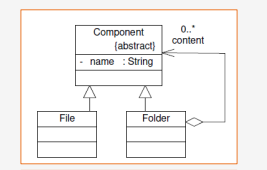
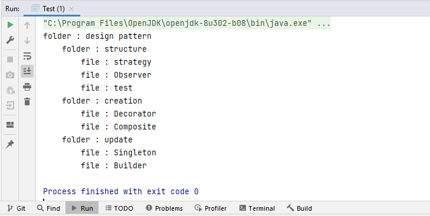

# Pattern Composite 
## Example d'application
Example of application for the composite design pattern: (Folders and Files) a folder can consist of several files in this example the file is a terminal element and the folder is a non-terminal element.
## Design of the problem using the strategy design pattern



## Implementation 

### Component
```java 
package composite;

public abstract class Composant {

    protected String name;
    protected int level;
    public Composant(String name) {
        this.name = name;
    }

    public abstract void show();

    public String tab() {
        String tab = "";
        for (int i = 0; i < level; i++) {
            tab = tab + "\t";
        }
        return tab;
    }
}

```  
### File
```java 
package composite;

public class File extends Composant {

    public File(String name) {
        super(name);
    }

    @Override
    public void show() {
        System.out.println(tab() + "file : " + name);
    }

}
```  
### Folder
```java
package composite;

import java.util.ArrayList;
import java.util.List;

public class Folder extends Composant {
    private final List<Composant> childs = new ArrayList<>();

    public Folder(String name) {
        super(name);
    }

    public Composant addComponent(Composant comp) {
        comp.level = this.level + 1;
        childs.add(comp);
        return comp;
    }

    @Override
    public void show() {
        System.out.println(tab() + "folder : " + name);
        for (Composant c : childs) {
            c.show();
        }
    }
}
```
Then we add several implementations of the Employee Strategy interface so that we can calculate the IGR in different countries
### MoroccoCalculateIGR
```java 
 package strategy;

public class MoroccoCalculateIGR implements IEmployeeStrategy{
    private final float rate1 = 5;
    private final float rate2 = 20;
    private final float rate3 = 42;
    @Override
    public float calculateIGR(float grossMonthlySalary) {
        float grossAnnualSalary=grossMonthlySalary*12;
        if(grossAnnualSalary <= 40000) return grossAnnualSalary*rate1/100;
        if(grossAnnualSalary > 40000 && grossAnnualSalary <= 120000) return grossAnnualSalary*rate2/100;
        if(grossAnnualSalary < 120000) return grossAnnualSalary*rate3/100;
        return  0;
    }
}
```  
### Test
```java 
package composite;

public class Test {

    public static void main(String[] args) {
        Folder root = new Folder("design pattern");
        Folder d1 = (Folder) root.addComponent(new Folder("structure"));
        Folder d2 = (Folder) root.addComponent(new Folder("creation"));
        Folder d3 = (Folder) root.addComponent(new Folder("update"));
        d1.addComponent(new File("strategy"));
        d1.addComponent(new File("Observer"));

        d2.addComponent(new File("Decorator"));

        d2.addComponent(new File("Composite"));
        d3.addComponent(new File("Singleton"));
        d3.addComponent(new File("Builder"));
        d1.addComponent(new File("test"));


        root.show();

    }

}
``` 

### Execution Example  Composite

