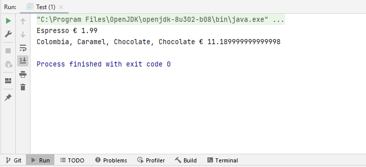

# Problem: Pattern Decorator 
Starbuzz Coffee has made a name for itself by becoming the largest chain of "coffee shops" in the United States. When they started, they designed their classes like this:


In addition to your coffee, you can also request
several ingredients, like

* milk froth
* caramel
* chocolate
* vanilla

Starbuzz Coffee, charging for each of these extras, they have
need to integrate them into their control system.

# Design of the problem using the decorator design pattern


# Implementation 

### Abstract Component Drink Class
```java 
package decorator;

public abstract class Drink {
    protected String description;
    public String getDescription() {
        return description;
    }
    public abstract double cost();
} 
```  
### Component Concrete Implementation
#### Colombia
```java 
package decorator.subDrink;

import decorator.Drink;

public class Colombia extends Drink {
    public Colombia(){
        description="Colombia";
    }
    public double cost() {
        return 7.89;
    }
}
```  
#### Espresso
```java 
package decorator.subDrink;

import decorator.Drink;

public class Espresso extends Drink {
    public Espresso(){
        description="Espresso";
    }
    public double cost() {
        return 1.99;
    }
}
```  
#### Sumatra
```java 
package decorator.subDrink;

import decorator.Drink;

public class Sumatra extends Drink {
    public Sumatra(){
        description="Sumatra";
    }
    public double cost() {
        return 8.99;
    }
}
```  
### DecoratorIngredient Class
```java 
package decorator;

public abstract class DecoratorIngredient extends Drink {
    protected Drink drink;
    public DecoratorIngredient(Drink drink) {
        this.drink = drink;
    }
    public abstract String getDescription();
}
```  

### Decorators
#### Chocolate


```java
package decorator.decorators;

import decorator.DecoratorIngredient;
import decorator.Drink;

public class Chocolate extends DecoratorIngredient {
    public Chocolate(Drink drink) {
        super(drink);
    }

    public double cost() {
        return 0.20 + drink.cost();
    }

    public String getDescription() {
        return drink.getDescription() + ", Chocolate";
    }
}
```
#### Caramel
```java
package decorator.decorators;

import decorator.DecoratorIngredient;
import decorator.Drink;

public class Caramel extends DecoratorIngredient {
    public Caramel(Drink drink) {
        super(drink);
    }

    public double cost() {
        return 2.90 + drink.cost();
    }

    public String getDescription() {
        return drink.getDescription() + ", Caramel";
    }
}
```
#### Vanilla
```java
package decorator.decorators;

import decorator.DecoratorIngredient;
import decorator.Drink;

public class Vanilla extends DecoratorIngredient {
    public Vanilla(Drink drink) {
        super(drink);
    }

    public double cost() {
        return 3.40 + drink.cost();
    }

    public String getDescription() {
        return drink.getDescription() + ", Vanilla";
    }
}
```


### Test
```java 
package decorator;

import decorator.decorators.Caramel;
import decorator.decorators.Chocolate;
import decorator.subDrink.Colombia;
import decorator.subDrink.Espresso;

public class Test {
    public static void main(String[] args) {
        Drink drink1=new Espresso();
        System.out.println(drink1.getDescription()+" € "+drink1.cost());
        Drink drink2=new Colombia();
        drink2=new Caramel(drink2);
        drink2=new Chocolate(drink2);
        drink2=new Chocolate(drink2);
        System.out.println(drink2.getDescription()+" € "+drink2.cost());
    }
}
``` 

### Execution Example  Decorator

