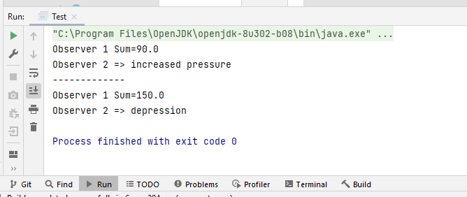

# Design Pattern Observer 


# Implementation 

### Observable Interface
```java 
package observer.observalble;

import observer.observers.Observer;


public interface Observable {

    void subscribe(Observer observer);

    void unsubscribe(Observer observer);

    void notifyObservers();

}
```  
### Observable Implementation

```java 
package observer.observalble;


import observer.observers.Observer;

import java.util.ArrayList;
import java.util.List;


public class ObservableImpl implements Observable {

    private final List<Observer> observers = new ArrayList<>();
    private int state;

    @Override
    public void subscribe(Observer observer) {
        observers.add(observer);
    }

    @Override
    public void unsubscribe(Observer observer) {
        observers.remove(observer);

    }

    public int getState() {
        return state;
    }

    public void setState(int state) {
        this.state = state;
        this.notifyObservers();
    }

    @Override
    public void notifyObservers() {
        for (Observer obs : observers) {
            obs.update(state);
        }

    }

}
```  
### Observer Interface

```java 
 package observer.observers;

public interface Observer {
    void update(int state);
}
```  
### Observer Implementation 1
```java 
package observer.observers;

public class ObserverImpl1 implements Observer {
    private double sum;
    @Override
    public void update(int state) {
        sum += state;
        System.out.println("Observer 1 Sum=" + sum);
    }
}
``` 
### Observer Implementation 2
```java 
package observer.observers;

public class ObserverImpl2 implements Observer {
    double lastState;

    @Override
    public void update(int state) {
        if (state - lastState > 0)
            System.out.println("Observer 2 => increased pressure");
        else if (state - lastState < 0)
            System.out.println("Observer 2 => depression");
        else System.out.println("Observer 2 => Stability");
        lastState = state;
    }
}
``` 

# Test
we implement a Test class for test
```java 
package observer.observers;

import observer.observalble.Observable;
import observer.observalble.ObservableImpl;

public class Test {
    public static void main(String[] args) {
        Observable observable = new ObservableImpl();
        Observer observer1 = new ObserverImpl1();
        Observer observer2 = new ObserverImpl2();
        observable.subscribe(observer1);
        observable.subscribe(observer2);
        ((ObservableImpl) observable).setState(90);
        System.out.println("-------------");
        ((ObservableImpl) observable).setState(60);
    }
}
``` 
### Execution Example  Observer

