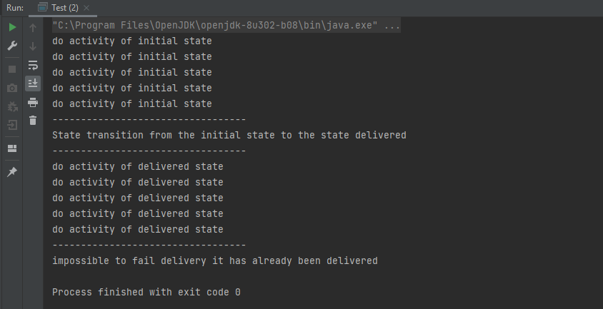

#  Pattern State 
State pattern is one of the behavioral design pattern. State design pattern is used when an Object changes its behavior based on its internal state.

If we have to change behavior of an object based on its state, we can have a state variable in the Object and use if-else condition block to perform different actions based on the state. State pattern is used to provide a systematic and lose-coupled way to achieve this through Context and State implementations.


## Description
Imagine that we want to code a delivery status management application. the delivery state may be initial state, delivered state, failed state or cancel state. We can therefore easily see that there are 4 different states possible for a delivery:
* initial
* delivered
* canceled
* failed


## Class diagram


## Implementation
First, we create an interface named IOrder in this form:
```java
package state;

public interface IOrder {
    void deliver();
    void cancelOrder();
    void failOrder();
    void doActivity();
}
``` 

Then we create the OrderImpl class which implements the Order interface
```java
package state;

public class OrderImpl implements IOrder {
    private State state;

    public OrderImpl(){
        state = new InitialState(this);
    }

    public void setState(State state) {
        this.state = state;
    }

    @Override
    public void deliver() {
        state.executeDeliver();
    }

    @Override
    public void cancelOrder() {
        state.executeCancelOrder();
    }

    @Override
    public void failOrder() {
        state.executeFailOrder();
    }

    @Override
    public void doActivity() {
        state.executeDoActivity();
    }
}
``` 
Then we create the abstract class State which contains the delegation of the methods of the IOrder interface
```java
package state;

public abstract class State {
    protected OrderImpl order;

    public State(OrderImpl order){
        this.order = order;
    }
    abstract void executeDeliver();
    abstract void executeCancelOrder();
    abstract void executeFailOrder();
    abstract void executeDoActivity();
}
``` 
Finally, we create the InitialState, DeliveredState, CanceledState and FailedState classes which will allow us to modify the state of the delivery
* InitialState
```java
package state;

public class InitialState extends State{

    public InitialState(OrderImpl order) {
        super(order);
    }

    @Override
    void executeDeliver() {
        System.out.println("State transition from the initial state to the state delivered ");
        order.setState(new DeliveredState(order));
    }

    @Override
    void executeCancelOrder() {
        System.out.println("State transition from the initial state to the state cancel");
        order.setState(new CancelState(order));
    }

    @Override
    void executeFailOrder() {
        System.out.println("State transition from the initial state to the state failed");
        order.setState(new FailedState(order));
    }

    @Override
    void executeDoActivity() {
        for (int i = 0; i < 5; i++) {
            System.out.println("do activity of initial state");
        }
    }
}
``` 
* DeliveredState
```java
package state;

public class DeliveredState extends State{

    public DeliveredState(OrderImpl order) {
        super(order);
    }

    @Override
    void executeDeliver() {
        System.out.println("impossible we are already in the state of delivery");
    }

    @Override
    void executeCancelOrder() {
        System.out.println("impossible we cannot cancel the delivery it is already delivered");
    }

    @Override
    void executeFailOrder() {
        System.out.println("impossible to fail delivery it has already been delivered");
    }

    @Override
    void executeDoActivity() {
        for (int i = 0; i < 5; i++) {
            System.out.println("do activity of delivered state");
        }
    }
}
``` 
* FailedState
```java
package state;

public class FailedState extends State{

    public FailedState(OrderImpl order) {
        super(order);
    }

    @Override
    void executeDeliver() {
        System.out.println("State transition from the failed state to the delivered state");
        order.setState(new DeliveredState(order));
    }

    @Override
    void executeCancelOrder() {
        System.out.println("State transition from the cancel state to the delivered state");
        order.setState(new CancelState(order));
    }

    @Override
    void executeFailOrder() {
        System.out.println("impossible we are already in the state  failed");
    }

    @Override
    void executeDoActivity() {
        for (int i = 0; i < 5; i++) {
            System.out.println("do activity of failed state");
        }
    }
}

``` 
* CancelState
```java
package state;

public class CancelState extends State{

    public CancelState(OrderImpl order) {
        super(order);
    }

    @Override
    void executeDeliver() {
        System.out.println("impossible we cannot delver the delivery it is already canceled");
    }

    @Override
    void executeCancelOrder() {
        System.out.println("impossible we are already in cancel state");
    }

    @Override
    void executeFailOrder() {
        System.out.println("impossible to fail delivery it has already been cancel");
    }

    @Override
    void executeDoActivity() {
        for (int i = 0; i < 5; i++) {
            System.out.println("do activity of cancel state");
        }
    }
}
``` 
## Test
### Test class
```java
package state;

public class Test {
    public static void main(String[] args) {
        IOrder order = new OrderImpl();
        order.doActivity();
        System.out.println("----------------------------------");
        order.deliver();
        System.out.println("----------------------------------");
        order.doActivity();
        System.out.println("----------------------------------");
        order.failOrder();
    }
}
``` 
### Result
