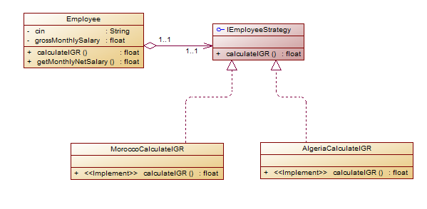
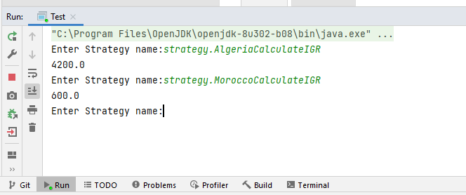

# Problem: Pattern Strategy 
We consider the class Employee (see appendix) which is defined by:
* two instance variables cin and grossMonthly salary,
* two constructors, the getters and setters
* and a method to calculate IGR which returns the general tax on wage income.
* The getSalaireNetMonthly method returns the monthly net salary.

Assuming the formula for calculating IGR differs from country to country.
In Morocco, for example, the calculation is carried out according to the following cases:
* If the annual salary is less than 40,000, the IGR rate is: 5%
* If the annual salary is greater than 40,000 and less than 120,000, the IGR rate is: 20%
* If the annual salary is greater than 120,000, the IGR rate is: 42%

In Algeria, the calculation is made using a single rate of 35%.

As this class is intended to be used in different kind of countries unknown at the time of development of
this class,
1. Identify the methods that will undergo changes in the client.
2. Applying the strategie pattern, try to make this class closed to modification and open to extension.
3. Create a test application.
4. Propose a solution to dynamically choose the IGR calculation implementation.

```java
public class Employee {
    private String cin;
    private float grossMonthlySalary;
    public Employee(String cin, float grossMonthlySalary) {
        this.cin = cin;
        this.grossMonthlySalary = grossMonthlySalary;
    }
    public float calculateIGR(){
        float GrossAnnualSalary=grossMonthlySalary*12;
        float rate=42;
        return GrossAnnualSalary*rate/100;
    }
    public float getMonthlyNetSalary(){
        float igr=calculateIGR();
        float annualNetSalary=grossMonthlySalary*12-igr;
        return annualNetSalary/12;
    }
// Getters et Setters
}
``` 
# Design of the problem using the strategy design pattern



# Implementation 

The change of the Employee class by adding a private attribute of type IEmployeeStrategy 
```java 
private IEmployeeStrategy employeeStrategy; 
```  
IEmployeeStrategy which contains a public method float calculateIGR (float grossMonthlySalary); and this to make the application closed to modification and open to extension and also to make implementations evolve independently of the Employee class.
```java 
package strategy;

public interface IEmployeeStrategy {
    public float calculateIGR(float grossMonthlySalary);
}

```  

Changed the calculateIGR method so that it can use the defferrent implementations of the IEmployeeStrategy interface.

```java 
 public float calculateIGR(){
       return employeeStrategy.calculateIGR(grossMonthlySalary);
    }
```  

Then we add several implementations of the Employee Strategy interface so that we can calculate the IGR in different countries
### MoroccoCalculateIGR
```java 
 package strategy;

public class MoroccoCalculateIGR implements IEmployeeStrategy{
    private final float rate1 = 5;
    private final float rate2 = 20;
    private final float rate3 = 42;
    @Override
    public float calculateIGR(float grossMonthlySalary) {
        float grossAnnualSalary=grossMonthlySalary*12;
        if(grossAnnualSalary <= 40000) return grossAnnualSalary*rate1/100;
        if(grossAnnualSalary > 40000 && grossAnnualSalary <= 120000) return grossAnnualSalary*rate2/100;
        if(grossAnnualSalary < 120000) return grossAnnualSalary*rate3/100;
        return  0;
    }
}
```  
### AlgeriaCalculateIGR

```java 
package strategy;

public class AlgeriaCalculateIGR implements IEmployeeStrategy{
private final float rate = 35;
@Override
public float calculateIGR(float grossMonthlySalary) {
float grossAnnualSalary = grossMonthlySalary * 12;
return grossAnnualSalary * rate /100;
}
}
```  

# Test
we implement a Test class to dynamically choose the IGR computation implementation, for that we will use 
```java 
Class.forName ()
``` 
### Implementation
```java 
package strategy;

import java.util.Scanner;

public class Test {
    public static void main(String[] args) {

        Employee employee = new Employee("T3423",1000);
        Scanner clavier=new Scanner(System.in);
        while(true){
            System.out.print("Enter Strategy name:");
            String nomStrategy=clavier.next();
            if(nomStrategy.equals("quit")) break;
            try {
                Class c = Class.forName(nomStrategy);
                IEmployeeStrategy strategy = (IEmployeeStrategy) c.newInstance();
                employee.setEmployeeStrategy(strategy);
                System.out.println(employee.calculateIGR());
            } catch (Exception e) {
                System.out.println(e);
            } }
    }
}
``` 

### Execution Example  Strategy

